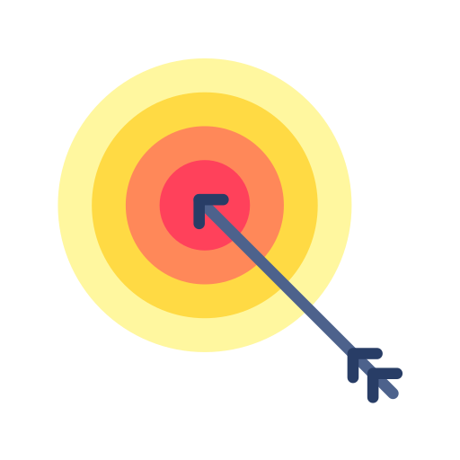

<h1 align="center">Goal Tracker Web App</h1>

  

Welcome to Goal Tracker – the perfect tool to help you achieve your goals one day at a time!

## Why Goal Tracker?

Are you looking to establish a new habit, reach a fitness milestone, or simply keep track of your progress? Goal Tracker has got you covered. Here's why you should use our app:

- 📈 **Easily Track Your Progress**: With a single click, you can increment your progress for the day.
- ⏰ **Daily Goal Tracking**: You can only increment your progress once every 24 hours, making it a daily routine.
- 🎯 **Custom Goals**: You can set up goals tailored to your needs, whether it's fitness, reading, or anything else.
- 🚫 **Reset Whenever Needed**: If you need to start over or make changes, resetting your progress is a breeze.
- 📅 **Visualize Your Progress**: Watch your achievements accumulate over time.
- 💬 **Share with Friends**: Share your progress with friends for added accountability.

## Getting Started

Ready to get started with Goal Tracker? It's super simple:

1. Click the "+1 Day Tracked" button to increment your progress.
2. If you ever need to start over, click the "Reset Tracker" button.

## Customization

You have control over the look and feel of Goal Tracker. Personalize it to your liking by modifying the CSS styles in the `style.css` file. Adjust colors, fonts, and other design elements to make it your own.

## License

This project is licensed under the MIT License - see the [LICENSE](LICENSE) file for details.

## Contact

If you have any questions or suggestions, please don't hesitate to contact us at [tanmaykalbande@proton.me](mailto:tanmaykalbande@proton.me).

---

Made with ♥️ to help you crush your goals!

